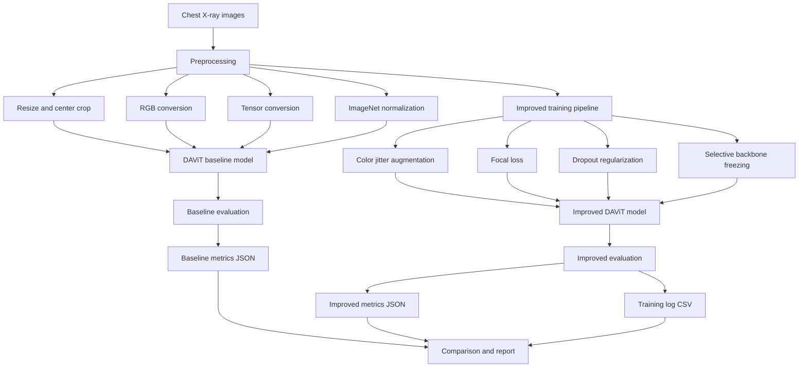
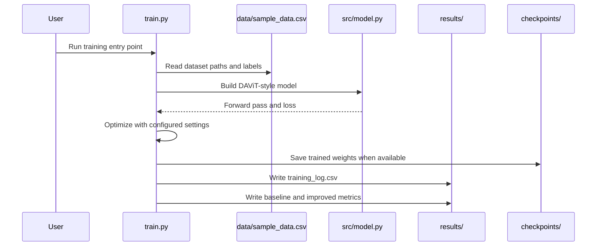
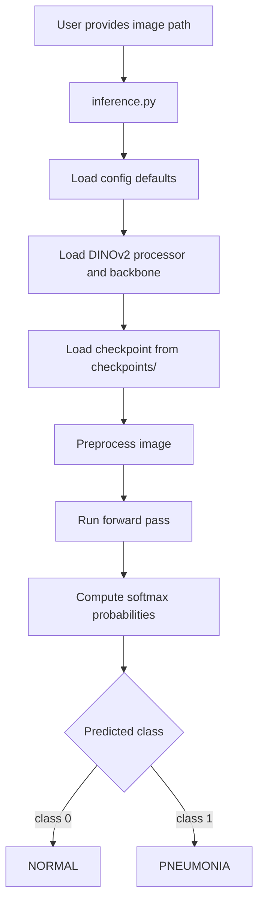
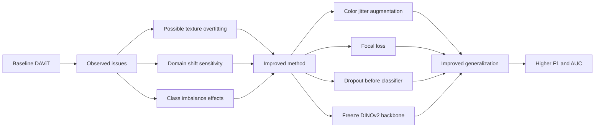

# Cross-Domain DAViT Pneumonia Detection

This repository contains a cleaned deep learning submission for pneumonia detection from chest X-ray images using a DAViT-style model. The baseline is based on the paper **DAViT: A Domain-Adapted Vision Transformer for Automated Pneumonia Detection and Explanation Using Chest X-Ray Images**. The improved version keeps the same core idea but adds stronger augmentation, focal loss, dropout regularization, and selective fine-tuning to improve robustness.

Baseline paper: https://doi.org/10.1109/ACCESS.2025.3579314

## Project Summary

The project compares a baseline DAViT pneumonia detector with an improved training setup. DAViT combines a DINOv2 Vision Transformer backbone for global chest X-ray representation learning with a shallow CNN head for local feature refinement. The final classifier predicts whether an X-ray belongs to the `NORMAL` or `PNEUMONIA` class.

The improvement focuses on making the classifier less brittle under dataset shift by using focal loss, dropout, corrected dataset labeling, and controlled backbone freezing.

## Results

| Model | Accuracy | F1 | Precision | Recall | Specificity | AUC |
|---|---:|---:|---:|---:|---:|---:|
| Baseline DAViT | 96.15% | 96.95% | 95.98% | 97.95% | 93.16% | 95.56% |
| Improved DAViT | 96.49% | 97.55% | 99.04% | 96.10% | 97.53% | 96.82% |

## Repository Structure

```text
Deep-Learning-Project/
|-- README.md
|-- requirements.txt
|-- train.py
|-- inference.py
|-- config.yaml
|-- data/
|   `-- sample_data.csv
|-- notebooks/
|   `-- 01_inference_demo.ipynb
|-- src/
|   |-- model.py
|   |-- dataset.py
|   `-- utils.py
|-- results/
|   |-- baseline_metrics.json
|   |-- improved_metrics.json
|   `-- training_log.csv
`-- checkpoints/
    `-- README.md
```

## Complete Project Workflow



## Model Architecture


## Training and Evaluation Pipeline



## Inference Pipeline



## File Responsibilities

```mermaid
flowchart TB
    A["README.md"] --> A1["Project explanation, metrics, diagrams"]
    B["requirements.txt"] --> B1["Python dependencies"]
    C["config.yaml"] --> C1["Model, data, and training settings"]
    D["train.py"] --> D1["Training entry point"]
    E["inference.py"] --> E1["Single-image inference entry point"]
    F["src/model.py"] --> F1["DAViT model, CNN head, focal loss"]
    G["src/dataset.py"] --> G1["CSV dataset and preprocessing"]
    H["src/utils.py"] --> H1["Metric helper functions"]
    I["results/"] --> I1["Baseline, improved, and training metrics"]
    J["notebooks/"] --> J1["Inference demonstration notebook"]
    K["checkpoints/"] --> K1["Expected location for model weights"]
```



## Improvements Over Baseline



## Setup

Install dependencies:

```bash
pip install -r requirements.txt
```

## Training

Run the training entry point:

```bash
python train.py --config config.yaml
```

The configured checkpoint location is:

```text
checkpoints/davit_pneumonia_detection.bin
```

## Inference

Run single-image inference after placing model weights in `checkpoints/`:

```bash
python inference.py --image path/to/image.png --checkpoint checkpoints/davit_pneumonia_detection.bin
```

The script prints the predicted class and probabilities for `NORMAL` and `PNEUMONIA`.

## Notebook

The required inference notebook is located at:

```text
notebooks/01_inference_demo.ipynb
```

## Outputs

The required result files are:

```text
results/baseline_metrics.json
results/improved_metrics.json
results/training_log.csv
```

These files summarize the baseline and improved DAViT performance used in the project comparison.
